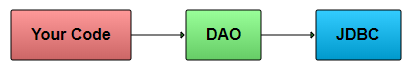
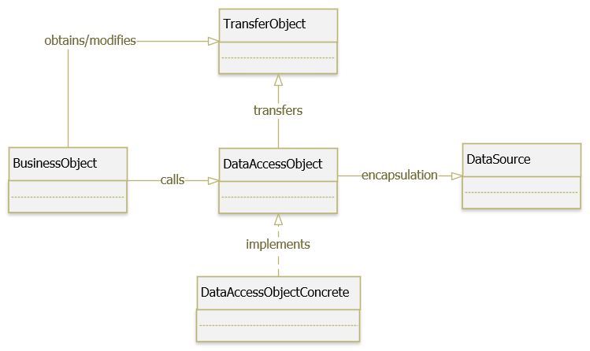

## Data Access Object (DAO) Pattern là một trong những Pattern thuộc nhóm cấu trúc (Structural Pattern).  Mẫu thiết kế DAO được sử dụng để phân tách logic lưu trữ dữ liệu trong một lớp riêng biệt. Theo cách này, các service được che dấu về cách các hoạt động cấp thấp để truy cập cơ sở dữ liệu được thực hiện. Nó còn được gọi là nguyên tắc Tách logic (Separation of Logic).

### Ý tưởng là thay vì có logic giao tiếp trực tiếp với cơ sở dữ liệu, hệ thống file, dịch vụ web hoặc bất kỳ cơ chế lưu trữ nào mà ứng dụng cần sử dụng, chúng ta sẽ để logic này sẽ giao tiếp với lớp trung gian DAO. Lớp DAO này sau đó giao tiếp với hệ thống lưu trữ, hệ quản trị CSDL như thực hiện các công việc liên quan đến lưu trữ và truy vấn dữ liệu (tìm kiếm, thêm, xóa, sửa,…).

