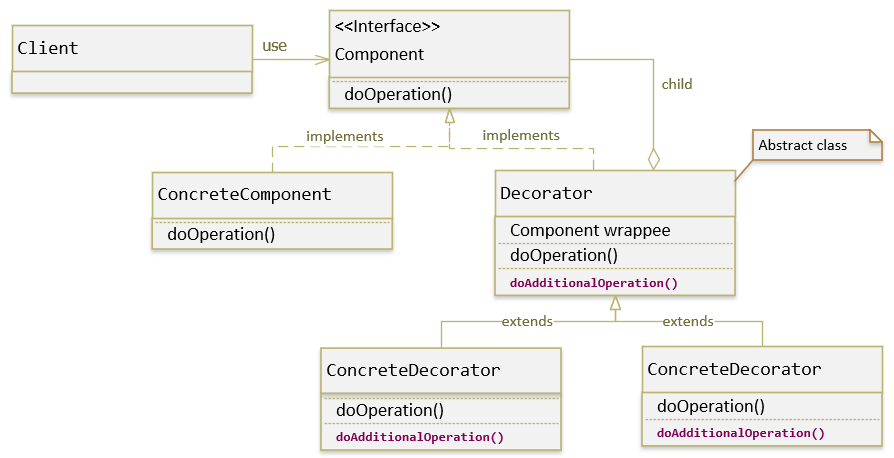

## Decorator pattern là một trong những Pattern thuộc nhóm cấu trúc (Structural Pattern). Nó cho phép người dùng thêm chức năng mới vào đối tượng hiện tại mà không muốn ảnh hưởng đến các đối tượng khác. Kiểu thiết kế này có cấu trúc hoạt động như một lớp bao bọc (wrap) cho lớp hiện có. Mỗi khi cần thêm tính năng mới, đối tượng hiện có được wrap trong một đối tượng mới (decorator class).
### Decorator pattern sử dụng composition thay vì inheritance (thừa kế) để mở rộng đối tượng. Decorator pattern còn được gọi là Wrapper hay Smart Proxy.

### Decorator pattern hoạt động dựa trên một đối tượng đặc biệt, được gọi là decorator (hay wrapper). Nó có cùng một interface như một đối tượng mà nó cần bao bọc (wrap), vì vậy phía client sẽ không nhận thấy khi bạn đưa cho nó một wrapper thay vì đối tượng gốc.
