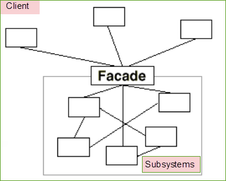

## Facade Pattern là một trong những Pattern thuộc nhóm cấu trúc (Structural Pattern). Pattern này cung cấp một giao diện chung đơn giản thay cho một nhóm các giao diện có trong một hệ thống con (subsystem). Facade Pattern định nghĩa một giao diện ở một cấp độ cao hơn để giúp cho người dùng có thể dễ dàng sử dụng hệ thống con này.

## Facade Pattern cho phép các đối tượng truy cập trực tiếp giao diện chung này để giao tiếp với các giao diện có trong hệ thống con. Mục tiêu là che giấu các hoạt động phức tạp bên trong hệ thống con, làm cho hệ thống con dễ sử dụng hơn.

### Ví dụ khi không có Facade, hệ thống của chúng ta trông giống như sau:

### Khi có Facade, nó trông giống như sau:

